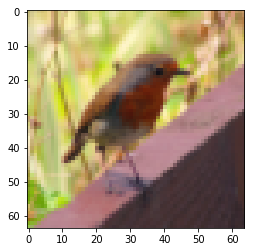

# <pre>Deep Neural Network- Step by Step<pre>

### Objectives
<p> The outline of the assigment is to build a deep neural network for a image classification task is as follows: <p>

* Initialize the parameters for a L layer neural network.
* Implement the forward propagation module to compute the activation functions for L layers. We calculate RELU function for L-1 layers and Sigmoid function for the Lth layer. We store Z as a cache to be used in while calculating gradients in the backward propagation.
* Compute the loss.
* Implement the backward propagation module to compute the gradients of activation function and parameters.
* Update the parameters using gradient descent method.

### Notation
- Superscript [*l*] denotes a quantity associated with the *l<sup>th</sup>* layer. 
    - Example: *a<sup>[L]</sup>* is the *L<sup>th</sup>* layer activation. *W<sup>[L]</sup>* and *b<sup>[L]</sup>* are the *L<sup>th</sup>* layer parameters.
- Superscript *(i)* denotes a quantity associated with the *i<sup>th</sup>* example. 
    - Example: *x<sup>(i)</sup>* is the *i<sup>th</sup>* training example.
- Lowerscript *i* denotes the *i<sup>th</sup>* entry of a vector.
    - Example: *a<sup>[l]_i</sup>* denotes the *i<sup>th</sup>* entry of the *l<sup>th</sup>* layer's activations.
    
### Importing Libraries
```python
import time
import numpy as np
import h5py
import matplotlib.pyplot as plt
import scipy
from PIL import Image
from scipy import ndimage
%matplotlib inline
plt.rcParams['figure.figsize'] = (5.0, 4.0) # set default size of plots
plt.rcParams['image.interpolation'] = 'nearest'
plt.rcParams['image.cmap'] = 'gray'

%load_ext autoreload
%autoreload 2

np.random.seed(1)
```

### Initialization
We write a helper function to initialize the parameters. 
We store *n<sup>l</sup>*, the number of units in different layers in a variable `layer_dims`. For example, `layer_dims`= [2,4,1] is a neural network with 2 inputs, one hidden layer with 4 neurons, one output layer with one output unit.

```python
def initialize_parameters_deep(layer_dims):
    """
    Arguments:
    layer_dims -- python array (list) containing the dimensions of each layer in our network
    
    Returns:
    parameters -- python dictionary containing your parameters "W1", "b1", ..., "WL", "bL":
                    Wl -- weight matrix of shape (layer_dims[l], layer_dims[l-1])
                    bl -- bias vector of shape (layer_dims[l], 1)
    """
    parameters={}
    L= len(layer_dims)
    
    for l in range(1,L):
        parameters['W'+str(l)]= np.random.randn(layer_dims[l], layer_dims[l-1])*0.01
        parameters['b'+str(l)]= np.zeros((layer_dims[l],1))
        
        assert(parameters['W' + str(l)].shape == (layer_dims[l], layer_dims[l-1]))
        assert(parameters['b' + str(l)].shape == (layer_dims[l], 1))
        
    return parameters
```
###  Forward propagation module

#### -Linear Forward 
After initializing the parameters, we will now do the forward propagation module. We will implement some basic functions that we will use later when implementing the model. We will complete three functions in this order:

- LINEAR
- LINEAR -> ACTIVATION where ACTIVATION will be either ReLU or Sigmoid. 
- [LINEAR -> RELU] **X** (L-1) -> LINEAR -> SIGMOID (whole model)

The linear forward module (vectorized over all the examples) computes the following equations:

*Z<sup>[l]</sup> = W<sup>[l]</sup>A<sup>[l-1]</sup> +b<sup>[l]</sup>*

where *A<sup>[0]</sup> = X*. 

```python
def linear_forward(A,W,b):
    """
    Implement the linear part of a layer's forward propagation.

    Arguments:
    A -- activations from previous layer (or input data): (size of previous layer, number of examples)
    W -- weights matrix: numpy array of shape (size of current layer, size of previous layer)
    b -- bias vector, numpy array of shape (size of the current layer, 1)

    Returns:
    Z -- the input of the activation function, also called pre-activation parameter 
    cache -- a python dictionary containing "A", "W" and "b" ; stored for computing the backward pass efficiently
    """
    
    Z= np.dot(W,A)+b
    
    assert(Z.shape==(W.shape[0],A.shape[1]))
    
    cache= (A,W,b)
    
    return Z, cache
```
#### - Linear Activation Forward
We use two activation functions:
-  **Sigmoid**: 
<a href="https://www.codecogs.com/eqnedit.php?latex=\sigma&space;(Z)=&space;\sigma&space;(W&space;A&space;&plus;&space;b)=&space;\frac{1}{1&plus;e^-{(W&space;A&space;&plus;&space;b)}}" target="_blank"></a>

```python
def sigmoid(Z):
    A = 1/(1+np.exp(-Z))
    cache = Z
    return A, cache
```
-  **ReLU**:
<a href="https://www.codecogs.com/eqnedit.php?latex=A=&space;RELU(Z)=&space;max(0,Z)" target="_blank"></a>

```python
def relu(Z):
    A = np.maximum(0,Z)
    
    assert(A.shape == Z.shape)
    
    cache = Z 
    return A, cache
```

```python
def linear_activation_forward(A_prev,W,b,activation):
    """
    Implement the forward propagation for the LINEAR->ACTIVATION layer

    Arguments:
    A_prev -- activations from previous layer (or input data): (size of previous layer, number of examples)
    W -- weights matrix: numpy array of shape (size of current layer, size of previous layer)
    b -- bias vector, numpy array of shape (size of the current layer, 1)
    activation -- the activation to be used in this layer, stored as a text string: "sigmoid" or "relu"

    Returns:
    A -- the output of the activation function, also called the post-activation value 
    cache -- a python dictionary containing "linear_cache" and "activation_cache";
             stored for computing the backward pass efficiently
    """
    
    if activation=='sigmoid':
        Z, linear_cache= linear_forward(A_prev,W,b)
        A, activation_cache= sigmoid(Z)
        
    elif activation=='relu':
        Z, linear_cache= linear_forward(A_prev,W,b)
        A, activation_cache= relu(Z)
    
    assert(A.shape==(W.shape[0],A_prev.shape[1]))
    cache= (linear_cache, activation_cache)
    return A, cache
```

Now, we will create a function which implements the function `linear_activation_forward` created in the last step with `RELU` *L-1* times and with `Sigmoid` one time for the *L<sup>th</sup>* layer.

In the code below, the variable `AL` denotes activation function for the *L<sup>th</sup>* layer.

```python
def L_model_forward(X, parameters):
    caches=[]
    A=X
    L= len(parameters)//2
    
    for l in range(1,L):
        A_prev=A
        A,cache= linear_activation_forward(A_prev, parameters['W'+str(l)],
                                          parameters['b'+str(l)],
                                          activation='relu')
        caches.append(cache)
    AL, cache= linear_activation_forward(A, parameters['W'+str(L)],
                                          parameters['b'+str(L)],
                                          activation='sigmoid')
    caches.append(cache)
    
    assert(AL.shape==(1, X.shape[1]))
    
    return AL, caches
```

Now we calculate the cross-entropy loss, so as to check whether our model is learning or not. Our objective is to minimize the cost by optimizing the parameters `W` and `b` using gradient descent.

<a href="https://www.codecogs.com/eqnedit.php?latex=Cost=&space;J=&space;-\frac{1}{m}\sum&space;(y^{(i)}log(a^{[L](i)})&plus;(1-y^{(i)})log(1-a^{[L](i)}))" target="_blank"></a>

```python
def compute_cost(AL,Y):
    m= Y.shape[1]
    
    cost= -(1/m)*np.sum(Y*np.log(AL)+(1-Y)*np.log(1-AL))
    cost= np.squeeze(cost)
    assert(cost.shape==())
    return cost
```

### Backward Propagation Module

Similar to forward propagation module, we will create helper functions to caclulate gradients of the Loss functions with respect to the parameters.
We will achieve this in 3 steps:
- LINEAR backward
- LINEAR -> ACTIVATION backward where ACTIVATION computes the derivative of either the ReLU or sigmoid activation
- [LINEAR -> RELU] **X** (L-1) -> LINEAR -> SIGMOID backward (whole model)

For a layer l, linear part is *Z<sup>[l]</sup> = W<sup>[l]</sup>A<sup>[l-1]</sup> +b<sup>[l]</sup>*. Suppose we have already calculated the derivative *dZ<sup>[l]</sup>*.
The three outputs(*dW<sup>[l]</sup>*, *db<sup>[l]</sup>*, *dA<sup>[l]</sup>*) are calculated using *dZ<sup>[l]</sup>* using the following formulas:
1. <a href="https://www.codecogs.com/eqnedit.php?latex=dW^{[l]}=&space;\frac{dL}{dW^{[l]}}=&space;\frac{1}{m}dZ^{[l]}A^{[l-1]T}" target="_blank"></a>
2. <a href="https://www.codecogs.com/eqnedit.php?latex=db^{[l]}=&space;\frac{dL}{db^{[l]}}=&space;\frac{1}{m}\sum_{i=1}^{m}dZ^{[l]}" target="_blank"></a>
3. <a href="https://www.codecogs.com/eqnedit.php?latex=dA^{[l-1]}=&space;\frac{dL}{dA^{[l-1]}}=&space;W^{[l]T}dZ^{[l]}" target="_blank"></a>

```python
def linear_backward(dZ, cache):
    A_prev, W,b= cache
    m= A_prev.shape[1]
    dW= (1/m)*np.dot(dZ, A_prev.T)
    db= (1/m)*np.sum(dZ, axis=1, keepdims=True)
    dA_prev= np.dot(W.T, dZ)
    
    assert(dA_prev.shape==A_prev.shape)
    assert (dW.shape == W.shape)
    assert (db.shape == b.shape)
    
    return dA_prev, dW, db
```

In order to calculate the gradients of the Loss function w.r.t parameters, we first need to calculate *dZ<sup>[l]</sup>*. We will two backward functions `sigmoid_backward` and `relu_backward` which calculates *dZ<sup>[l]</sup>* as <a href="https://www.codecogs.com/eqnedit.php?latex=dZ^{[l]}=&space;dA^{[l]}\ast&space;{g}'(Z^{[l]})" target="_blank"></a>.

```python
def relu_backward(dA, cache):
    """
    Implement the backward propagation for a single RELU unit.
    Arguments:
    dA -- post-activation gradient, of any shape
    cache -- 'Z' where we store for computing backward propagation efficiently
    Returns:
    dZ -- Gradient of the cost with respect to Z
    """
    
    Z = cache
    dZ = np.array(dA, copy=True) # just converting dz to a correct object.
    
    # When z <= 0, you should set dz to 0 as well. 
    dZ[Z <= 0] = 0
    
    assert (dZ.shape == Z.shape)
    
    return dZ
```

```python
def sigmoid_backward(dA, cache):
    """
    Implement the backward propagation for a single SIGMOID unit.
    Arguments:
    dA -- post-activation gradient, of any shape
    cache -- 'Z' where we store for computing backward propagation efficiently
    Returns:
    dZ -- Gradient of the cost with respect to Z
    """
    
    Z = cache
    
    s = 1/(1+np.exp(-Z))
    dZ = dA * s * (1-s)
    
    assert (dZ.shape == Z.shape)
    
    return dZ
```

Now we can implement these functions with the `linear_backward` function created before to calculate *dW<sup>[l]</sup>*, *db<sup>[l]</sup>* and *dA<sup>[l]</sup>*

```python
def linear_activation_backward(dA, cache, activation):
    linear_cache, activation_cache= cache
    
    if activation=='relu':
        dZ= relu_backward(dA, activation_cache)
        dA_prev, dW, db= linear_backward(dZ, linear_cache)
    elif activation=='sigmoid':
        dZ= sigmoid_backward(dA, activation_cache)
        dA_prev, dW, db= linear_backward(dZ, linear_cache)
    return dA_prev, dW,db
```

Now we will implement backward function for the whole network. Remember, we stored (X,W,b,Z) in a value cache when we implemented `L_model_forward`. We will use these cache values while iterating through all hidden layers starting from layer L. 
For Layer l, we know that <a href="https://www.codecogs.com/eqnedit.php?latex=A^{[L]}=&space;\sigma(Z^{[L]})" target="_blank"></a>. We need to calculate dA<sup>[L]</sup> which we will feed in the back propagation module for the whole network. dA<sup>[L]</sup> is calculated as
dAL = - (np.divide(Y, AL) - np.divide(1 - Y, 1 - AL)) # derivative of cost with respect to AL.
We will store dA, dW, db in a grads dictionary.

```python
def L_model_backward(AL, Y, caches):
    """
    Implement the backward propagation for the [LINEAR->RELU] * (L-1) -> LINEAR -> SIGMOID group
    
    Arguments:
    AL -- probability vector, output of the forward propagation (L_model_forward())
    Y -- true "label" vector (containing 0 if non-cat, 1 if cat)
    caches -- list of caches containing:
                every cache of linear_activation_forward() with "relu" (it's caches[l], for l in range(L-1) i.e l = 0...L-2)
                the cache of linear_activation_forward() with "sigmoid" (it's caches[L-1])
    
    Returns:
    grads -- A dictionary with the gradients
             grads["dA" + str(l)] = ... 
             grads["dW" + str(l)] = ...
             grads["db" + str(l)] = ... 
    """
    grads={}
    L= len(caches)
    m= AL.shape[1]
    Y.reshape(AL.shape)
    
    dAL= - (np.divide(Y, AL) - np.divide(1 - Y, 1 - AL)) # derivative of cost with respect to AL
    
    # Lth layer (SIGMOID -> LINEAR) gradients. Inputs: "AL, Y, caches". Outputs: "grads["dAL"], grads["dWL"], grads["dbL"]
    current_cache= caches[-1]
    grads['dA'+str(L)], grads['dW'+str(L)], grads['db'+str(L)]= linear_activation_backward(dAL, current_cache, 
                                                                                           activation='sigmoid')
    
    for l in reversed(range(L-1)):
        # lth layer: (RELU -> LINEAR) gradients.
        # Inputs: "grads["dA" + str(l + 2)], caches". Outputs: "grads["dA" + str(l + 1)] , grads["dW" + str(l + 1)] , grads["db" + str(l + 1)] 
        
        current_cache= caches[l]
        dA_prev_temp, dW_temp, db_temp= linear_activation_backward(grads['dA'+str(l+2)], current_cache, 
                                                                  activation= 'relu')
        grads['dA'+str(l)]= dA_prev_temp
        grads['dW'+str(l+1)]= dW_temp
        grads['db'+str(l+1)]= db_temp
    
    return grads
```

We will update the parameters of the model using gradient descent method as:
1. <a href="https://www.codecogs.com/eqnedit.php?latex=W^{[l]}=&space;W^{[l]}-\alpha&space;dW^{[l]}" target="_blank"></a>
2. <a href="https://www.codecogs.com/eqnedit.php?latex=b^{[l]}=&space;b^{[l]}-\alpha&space;db^{[l]}" target="_blank"></a>

where <a href="https://www.codecogs.com/eqnedit.php?latex=\alpha" target="_blank"></a> is the learning rate.

```python
def update_parameters(parameters,grads, learning_rate):
    
    L= len(parameters)//2
    for l in range(L):
        parameters['W'+str(l+1)]= parameters['W'+str(l+1)]-learning_rate*grads['dW'+str(l+1)]
        parameters['b'+str(l+1)]= parameters['b'+str(l+1)]-learning_rate*grads['db'+str(l+1)]
    return parameters
```

### Prediction

Creating a function to predict the results of a L-layered deep neural network

```python
def predict(X,y, parameters):
    
    """
    This function is used to predict the results of a  L-layer neural network.
    
    Arguments:
    X -- data set of examples you would like to label
    parameters -- parameters of the trained model
    
    Returns:
    p -- predictions for the given dataset X
    """
    
    m= X.shape[1]
    L= len(parameters)//2
    p= np.zeros((1,m))
    
    probas, caches= L_model_forward(X, parameters)
    
    for i in range(0, probas.shape[1]):
        if probas[0,i]>0.5:
            p[0,i]=1
        else:
            p[0,i]=0
    print("Accuracy: "  + str(np.sum((p == y)/m)))
        
    return p
```

We will use all the functions created above to classify images whether they are cat or not. The data is in `h5` format. We first create a function `load_dataset` to load the data and split it into training and testing. The dataset contains:

- a training set of m_train images labelled as cat (1) or non-cat (0)
- a test set of m_test images labelled as cat and non-cat
- each image is of shape (num_px, num_px, 3) where 3 is for the 3 channels (RGB).

```python
def load_dataset():
    train_dataset = h5py.File('datasets/train_catvnoncat.h5', "r")
    train_set_x_orig = np.array(train_dataset["train_set_x"][:]) # your train set features
    train_set_y_orig = np.array(train_dataset["train_set_y"][:]) # your train set labels

    test_dataset = h5py.File('datasets/test_catvnoncat.h5', "r")
    test_set_x_orig = np.array(test_dataset["test_set_x"][:]) # your test set features
    test_set_y_orig = np.array(test_dataset["test_set_y"][:]) # your test set labels

    classes = np.array(test_dataset["list_classes"][:]) # the list of classes
    
    train_set_y_orig = train_set_y_orig.reshape((1, train_set_y_orig.shape[0]))
    test_set_y_orig = test_set_y_orig.reshape((1, test_set_y_orig.shape[0]))
    
    return train_set_x_orig, train_set_y_orig, test_set_x_orig, test_set_y_orig, classes
```

Let's load the data and check the image for a random index.

```python
train_x_orig, train_y, test_x_orig, test_y, classes = load_data()

index = 10
plt.imshow(train_x_orig[index])
print ("y = " + str(train_y[0,index]) + ". It's a " + classes[train_y[0,index]].decode("utf-8") +  " picture.")

```
`y = 0. It's a non-cat picture.`


```python
## Explore the dataset 
m_train = train_x_orig.shape[0]
num_px = train_x_orig.shape[1]
m_test = test_x_orig.shape[0]

print ("Number of training examples: " + str(m_train))
print ("Number of testing examples: " + str(m_test))
print ("Each image is of size: (" + str(num_px) + ", " + str(num_px) + ", 3)")
print ("train_x_orig shape: " + str(train_x_orig.shape))
print ("train_y shape: " + str(train_y.shape))
print ("test_x_orig shape: " + str(test_x_orig.shape))
print ("test_y shape: " + str(test_y.shape))
```
```
Number of training examples: 209
Number of testing examples: 50
Each image is of size: (64, 64, 3)
train_x_orig shape: (209, 64, 64, 3)
train_y shape: (1, 209)
test_x_orig shape: (50, 64, 64, 3)
test_y shape: (1, 50)
```
